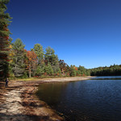

---
---
<link rel="stylesheet" href="https://use.fontawesome.com/releases/v5.8.2/css/all.css" integrity="sha384-oS3vJWv+0UjzBfQzYUhtDYW+Pj2yciDJxpsK1OYPAYjqT085Qq/1cq5FLXAZQ7Ay" crossorigin="anonymous">

<link rel="stylesheet" href="https://cdn.jsdelivr.net/npm/@splidejs/splide@latest/dist/css/splide.min.css">
Hi, I'm **Richard**, AKA parsingphase

I take photos as a hobby, and write code as a profession.

	

		<ul class="splide__list">
			<li class="splide__slide">

			</li>
			<li class="splide__slide">

			</li>
			<li class="splide__slide">

			</li>
		</ul>
	

