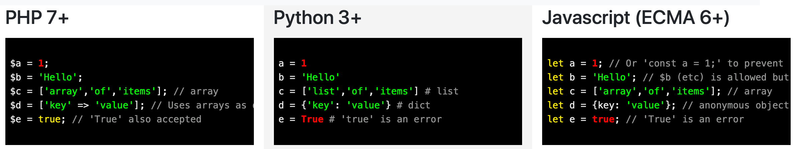
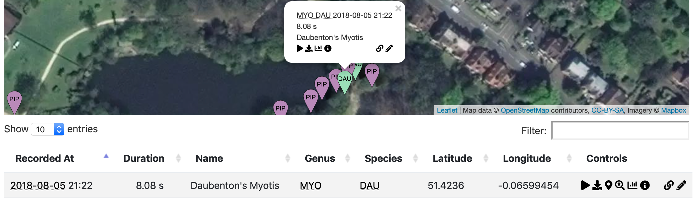
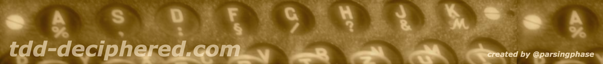
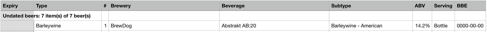
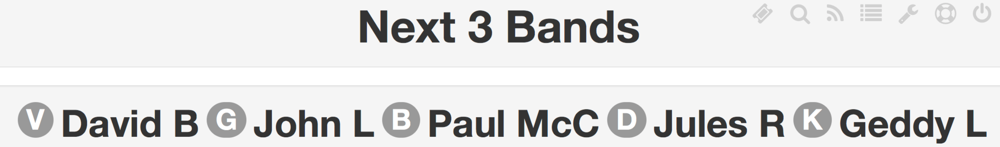

---
---
<link rel="stylesheet" href="https://use.fontawesome.com/releases/v5.8.2/css/all.css" integrity="sha384-oS3vJWv+0UjzBfQzYUhtDYW+Pj2yciDJxpsK1OYPAYjqT085Qq/1cq5FLXAZQ7Ay" crossorigin="anonymous">
Hi, I'm **Richard**, AKA parsingphase

I build things in PHP, Python and Javascript/Typescript

I create documentation and guides as well as software

Commercially, I've worked for companies including -

- \- [The London Internet Exchange](https://www.linx.net)
- \- [Snatch](https://www.snatchvip.com)
- \- [Quidco](https://www.quidco.com) 
- \- Amazon (at [The Book Depository](https://www.bookdepository.com))
- \- [Fitch Learning](https://www.fitchlearning.com)
- \- [Dennis Publishing](https://www.dennis.co.uk)
- \- [The Mind Gym](https://uk.themindgym.com)

I spent most of 2019 working on [IX-API](https://ix-api.net), 
and I've [written up my experience](https://medium.com/parsing-tech/ix-api-design-notes-and-recollections-27c55829d9e8)

My online, personal projects include:

## [Rosetta PPJ](https://parsingphase.dev/rosetta-ppj/)

 <i class="fab fa-php fa-lg"></i> PHP \| <i class="fab fa-python"></i> Python \| <i class="fab fa-js-square"></i> Javascript

A cheat sheet for anyone who, like me, finds swapping between multiple C-type languages confusing

 - <i class="fas fa-globe" title="Site"></i> [https://parsingphase.dev/rosetta-ppj](https://parsingphase.dev/rosetta-ppj/)
 - <i class="fab fa-github" title="Source"></i> [https://github.com/parsingphase/rosetta-ppj](https://github.com/parsingphase/rosetta-ppj)  

## [Batbox](https://batbox.phase.org) 

 <i class="fab fa-python"></i> Python \| <i class="fab fa-python"></i> Django \| <i class="fab fa-js-square"></i> Javascript \| <i class="fas fa-dollar-sign"></i> jQuery \| <i class="fab fa-docker"></i> Docker

A geovisualisation and search tool for audio recordings of bats tagged with the GUANO format.

 - <i class="fas fa-globe" title="Site"></i> [https://batbox.phase.org](https://batbox.phase.org) 
 - <i class="fas fa-book" title="Documentation"></i> [https://parsingphase.dev/batbox](https://parsingphase.dev/batbox) 
 - <i class="fab fa-github" title="Source"></i> [https://github.com/parsingphase/batbox](https://github.com/parsingphase/batbox)

## [TDD Deciphered](https://tdddeciphered.com) 

 <i class="fab fa-php fa-lg"></i> PHP \| <i class="fas fa-check-square"></i> TDD

A guide to Test-Driven Development built around [a simulation of the Engima machine](https://github.com/parsingphase/enigma-simulator), based on my time 
volunteering at [Bletchley Park](https://bletchleypark.org.uk)

 - <i class="fas fa-globe" title="Site"></i> [https://tdddeciphered.com](https://tdddeciphered.com) 
 - <i class="fab fa-github" title="Source"></i> [https://github.com/parsingphase/enigma-simulator](https://github.com/parsingphase/enigma-simulator)

## [Beerbot](https://beerbot.phase.org)

 <i class="fab fa-python"></i> Python \| <i class="fab fa-aws"></i> AWS Serverless

A processing tool for paid supporters of [Untappd](https://untappd.com/), supporting stocklist management and consumption tracking

 - <i class="fas fa-globe" title="Site"></i> [https://beerbot.phase.org](https://beerbot.phase.org)
 - <i class="fab fa-github" title="Source"></i> [https://github.com/parsingphase/untappd-tools](https://github.com/parsingphase/untappd-tools)
 
## [WeightInWhales](https://weightinwhales.com/)

A small salute to the most important of standardised comparison units, the metric blue whale

 <i class="fab fa-php fa-lg"></i> PHP \| <i class="fab fa-js-square"></i> Javascript \| <i class="fab fa-symfony"></i> Symfony \| <i class="fab fa-angular"></i> Angular

 - <i class="fas fa-globe" title="Site"></i> [https://weightinwhales.com](https://weightinwhales.com/) 

## [TakeATicket](https://parsingphase.dev/takeAticket/)

A management app for a karaoke-style event that I used to run with my wife and friends

 <i class="fab fa-php fa-lg"></i> PHP \| <i class="fab fa-js-square"></i> Javascript \| <i class="fab fa-symfony"></i> Symfony \| <i class="fas fa-dollar-sign"></i> jQuery \| <i class="fab fa-docker"></i> Docker

 - <i class="fas fa-book" title="Documentation"></i> [https://parsingphase.dev/takeAticket](https://parsingphase.dev/takeAticket/)
 - <i class="fab fa-github" title="Source"></i> [https://github.com/parsingphase/takeAticket](https://github.com/parsingphase/takeAticket)

## Minor projects

- <i class="fab fa-github" title="Source"></i> [https://github.com/parsingphase/technical-hitch](https://github.com/parsingphase/technical-hitch)
- <i class="fab fa-github" title="Source"></i> [https://github.com/parsingphase/4sl2gpx](https://github.com/parsingphase/4sl2gpx)

## Created for clients and open-sourced

- <i class="fab fa-github" title="Source"></i> [https://github.com/MapleSyrupGroup/dbsampler](https://github.com/MapleSyrupGroup/dbsampler)

## [Blog](https://phase.org/)

Somewhat in hiatus, but the [archive](https://phase.org/blog/archive) has a fair bit of content

- <i class="fas fa-globe"></i> [https://phase.org](https://phase.org/)

---

<i class="fas fa-envelope"></i> Contact: [richard@parsingphase.dev](mailto:richard@parsingphase.dev)

<i class="fas fa-key"></i> Keys: [https://keybase.io/parsingphase](https://keybase.io/parsingphase)

<i class="fab fa-github"></i> Github: [https://github.com/parsingphase](https://github.com/parsingphase)

<i class="fab fa-linkedin"></i> CV / Résumé: [https://www.linkedin.com/in/richardgeorge](https://www.linkedin.com/in/richardgeorge/)

<i class="fab fa-flickr"></i> Photos: [https://www.flickr.com/photos/parsingphase](https://www.flickr.com/photos/parsingphase/)