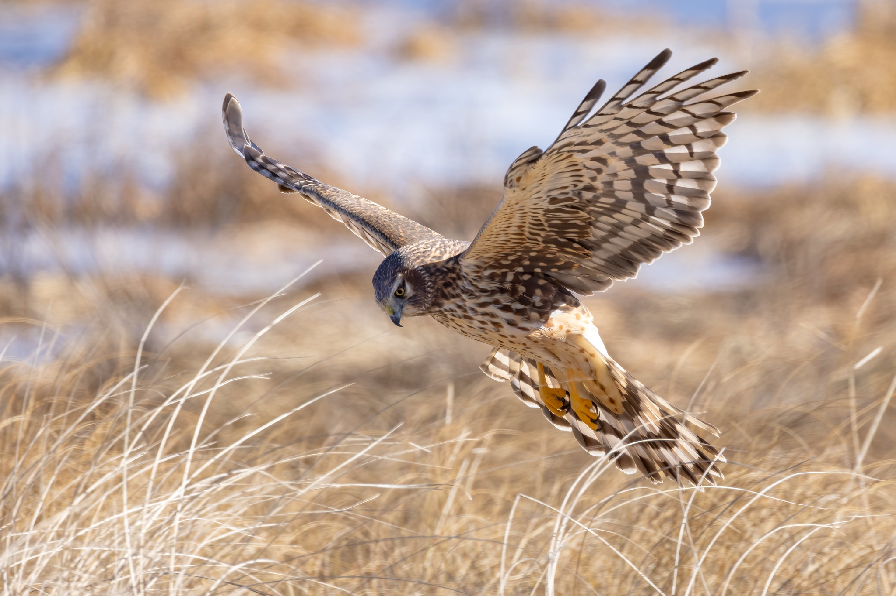

Hi, I'm **Richard**, AKA parsingphase

I take photos as a hobby, and write code as a profession.

<a href="/"> <i class="fas fa-laptop-code"></i> Software</a> | <i class="fas fa-camera"></i> Photography

<strong>Are you here because I gave you a card while birding?  You might be looking for my main collection at
<i class="fab fa-flickr"></i> [my Flickr account](https://www.flickr.com/photos/parsingphase) or
<i class="fa fa-leaf"></i> [my iNaturalist sightings](https://www.inaturalist.org/observations?user_id=parsingphase).</strong>

You might also be interested in my <strong><i class="fas fa-photo-video"></i> 
[trailcam videos on PeerTube](https://spectra.video/a/parsingphase/video-channels)</strong>.

---

I've been a casual photographer for most of my life, starting with
a [Disc Camera](https://clickamericana.com/media/photography/what-happened-to-kodak-disc-camera-debuted-in-1982) when I
was about 10. I got my first DSLR in about 2005, and it was a background hobby for a few years until lighter devices
improved enough to take over and the DSLRs sat on the shelf for a while.

Roll forward to 2020, a relocation to Massachusetts and COVID precautions resulting in spending a lot of time indoors,
watching migratory warblers in the maple tree outside our apartment window. Incredibly, the 15-year-old hobbyist DSLRs
(Canon 350D and 400D, aka Digital Rebel XT and XTi) and cheap 70-300mm zoom still worked perfectly and got some decent
shots (at all of 8 megapixels).

Then, just as the hobby was taking off again, I blew out the USB port, and got to remember the retro "joys" of
downloading from a Compact Flash card through a card reader. This was the tipping point to getting a new device - and
wow, had they improved in 15 years. Shooting with a new Canon EOS 90D, first with a Sigma 100-400mm zoom and then a
150-600mm, handheld, was getting some real results and soon my wife (equipped with an EOS Digital Rebel T8i)
and I were out shooting around once a week - and finding just how close to home wildlife can be found in Massachusetts.

This has proven to be more than just a hobby now - it's fresh air, it's family time, but it's also a great collection of
images and memories that are incredibly calming and satisfying to browse in a difficult year.

I've collected my favorites from this first year of wildlife photography at 
<i class="fas fa-globe"></i> [photography.parsingphase.com](https://photography.parsingphase.com). Many more images
can be found on
<i class="fab fa-flickr"></i> [my Flickr account](https://www.flickr.com/photos/parsingphase), where many of the
wildlife images are available under a
<i class="fab fa-creative-commons"></i> [by-nc-nd](https://creativecommons.org/licenses/by-nc-nd/2.0/) license.

In addition to the images themselves, I've also given <i class="far fa-images"></i>
[a talk on the topic](https://www.dropbox.com/s/g5wvf6jg6kpxwep/WildlifePhotographyWithPreamble.pdf)
and written up <i class="fab fa-medium"></i>
[Some Notes on DSLR Wildlife Photography](https://parsingphase.medium.com/some-notes-on-wildlife-photography-6370ea4f8965)
for new photographers which have proven popular.

<link rel="stylesheet" href="https://use.fontawesome.com/releases/v5.8.2/css/all.css" integrity="sha384-oS3vJWv+0UjzBfQzYUhtDYW+Pj2yciDJxpsK1OYPAYjqT085Qq/1cq5FLXAZQ7Ay" crossorigin="anonymous">
---

[Back to site index](..)